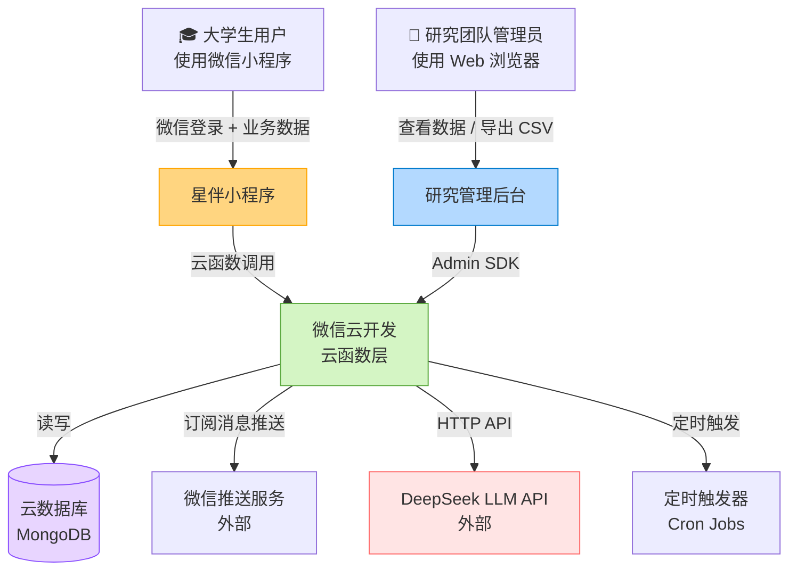
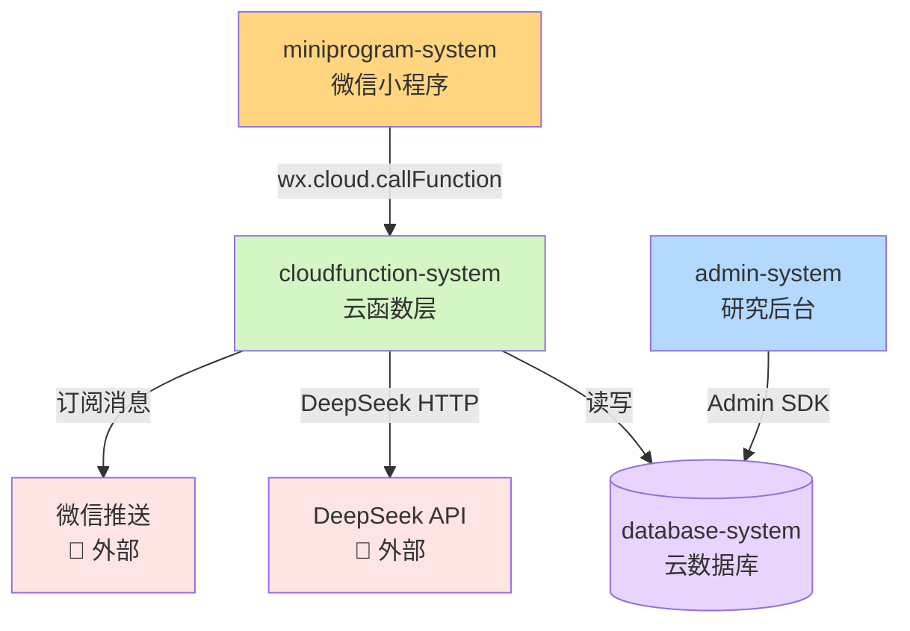

# 系统架构总览 (Architecture Overview)

**项目**: 星伴 (SparkMate)
**版本**: v1.0
**日期**: 2026-03-09

---

## 1. 系统上下文

### 1.1 C4 Level 1 - 系统上下文图



### 1.2 关键用户

| 用户类型 | 描述 | 使用系统 |
|---------|------|---------|
| **大学生用户** | 系统使用者 & 研究对象，80-120人 | 微信小程序 |
| **研究管理员** | 研究团队成员，查看与导出数据 | 研究管理后台 Web |

### 1.3 外部依赖

| 系统 | 用途 | 备注 |
|------|------|------|
| **微信开放平台** | 用户登录 (OpenID)、订阅消息推送 | 无法替代，平台绑定 |
| **DeepSeek API** | 伙伴聊天 LLM 对话 | 备选：通义千问 |
| **腾讯云 CloudBase** | 云函数 + 数据库 + 云托管 | 核心基础设施 |

---

## 2. 系统清单 (System Inventory)

项目共识别 **4 个独立系统**，按技术栈和部署单元拆分：

---

### System 1: 微信小程序前端
**系统 ID**: `miniprogram-system`

**职责**:
- 用户界面展示（微光崽动画、情绪滑块、专注计时器）
- 微信 API 调用（登录、keepScreenOn、振动、订阅消息授权）
- 调用云函数处理业务逻辑
- Lottie 动画渲染（微光崽各状态）

**边界**:
- **输入**: 用户触摸操作、微信生命周期事件（onHide/onShow）
- **输出**: 云函数调用（wx.cloud.callFunction）
- **依赖**: `cloudfunction-system`

**关联需求**: [REQ-001] [REQ-002] [REQ-003] [REQ-004] [REQ-005] [REQ-006]

**技术栈**:
- 框架: 微信原生小程序 (WXML/WXSS/TypeScript)
- 动画: lottie-miniprogram
- 状态管理: 小程序 globalData + 页面 data
- 构建: 微信开发者工具

**源码路径**: `src/miniprogram/`

**设计文档**: `04_SYSTEM_DESIGN/miniprogram-system.md` (待 /design-system 创建)

---

### System 2: 云函数层（后端逻辑）
**系统 ID**: `cloudfunction-system`

**职责**:
- 处理所有业务逻辑（专注记录写入、情绪打卡、量表提交）
- 执行每日数据探针（扫描低情绪+高中断率用户，生成主动触发记录）
- 调用 DeepSeek API（LLM 对话）
- 发送微信订阅消息（晚点名提醒、量表推送）
- T1/T2 量表时点调度（基于 onboard_at + Cron 触发器）
- 高风险用户检测和 Admin 告警

**云函数列表（初始规划）**:

| 函数名 | 触发方式 | 职责 |
|--------|---------|------|
| `user-onboard` | HTTP（小程序调用）| 注册用户，写知情同意 |
| `focus-write` | HTTP | 写入 FocusSession |
| `mood-checkin` | HTTP | 写入 MoodCheckin |
| `scale-submit` | HTTP | 提交量表，高风险检测 |
| `chat-session` | HTTP | 调用 DeepSeek，记录 ChatSession |
| `daily-probe` | 定时 (每日 08:00)| 数据探针，生成 ProactiveTrigger |
| `scale-scheduler` | 定时 (每日 09:00)| 检查 T1/T2 时点，推送量表通知 |
| `mood-reminder` | 定时 (21:25)| 推送晚点名订阅消息 |

**边界**:
- **输入**: 小程序 callFunction / HTTP 请求（Admin SDK）/ 定时触发
- **输出**: 云数据库读写、微信消息推送、DeepSeek API 响应
- **依赖**: `database-system`（CloudBase 云数据库）、DeepSeek API（外部）

**关联需求**: 全部

**技术栈**:
- 运行时: Node.js 18（CloudBase 云函数）
- LLM Client: openai SDK（兼容 DeepSeek API）
- 定时触发: CloudBase 定时触发器（Cron 表达式）

**源码路径**: `src/cloudfunctions/`

**设计文档**: `04_SYSTEM_DESIGN/cloudfunction-system.md` (待 /design-system 创建)

---

### System 3: 云数据库
**系统 ID**: `database-system`

**职责**:
- 持久化所有用户行为数据和研究数据
- 存储用户状态（高风险标记、养成进度）

**集合列表（Collections）**:

| 集合名 | 主要字段 | 说明 |
|--------|---------|------|
| `users` | user_id, openid, consent_given, onboard_at, schedule_slots, high_risk_flag | 用户基本信息 |
| `focus_sessions` | session_id, user_id, start_at, end_at, focus_duration_sec, distraction_count, ... | 专注会话 |
| `mood_checkins` | checkin_id, user_id, timestamp, mood_score, stress_tag, week_index | 情绪打卡 |
| `scale_records` | scale_id, user_id, scale_type, time_point, total_score, items[], high_risk_flag | 量表记录 |
| `chat_sessions` | session_id, user_id, trigger_type, pre_mood_score, post_mood_score, sentiment_shift_val | AI 聊天 |
| `proactive_triggers` | trigger_id, user_id, trigger_at, trigger_reason, delivered | 主动触发记录 |
| `resonance_pairs` | pair_id, user_a, user_b, streak_days, poke_count_a, poke_count_b | Phase 2 预留 |

**边界**:
- **输入**: MongoDB 兼容查询（来自云函数）
- **输出**: 查询结果
- **依赖**: 无（基础设施层）

**关联需求**: 全部数据持久化需求

**技术栈**:
- 数据库: CloudBase 云数据库（MongoDB 兼容）
- 访问方式: CloudBase SDK（云函数内）/ Admin SDK（后台）

**设计文档**: `04_SYSTEM_DESIGN/database-system.md` (待 /design-system 创建)

---

### System 4: 研究管理后台
**系统 ID**: `admin-system`

**职责**:
- 展示研究数据仪表盘（用户数、活跃率、情绪趋势、专注趋势）
- 高风险用户列表和告警
- 导出 CSV（按时间范围、字段选择）
- 管理员登录（研究团队内部使用）
- 手动设置 T2 量表时点（应对学期长度差异）

**边界**:
- **输入**: 研究管理员浏览器操作
- **输出**: HTTP 请求（CloudBase Admin SDK 调用）
- **依赖**: `database-system`（通过 Admin SDK 直接访问）

**关联需求**: [REQ-007]

**技术栈**:
- 框架: Next.js 15 (App Router)
- UI: TailwindCSS + shadcn/ui
- 图表: Recharts
- 数据访问: CloudBase Admin SDK（Server Action / API Route）
- 部署: CloudBase 云托管（Cloud Run）

**源码路径**: `src/admin/`

**设计文档**: `04_SYSTEM_DESIGN/admin-system.md` (待 /design-system 创建)

---

## 3. 系统边界矩阵

| 系统 | 输入 | 输出 | 依赖系统 | 被依赖系统 | 关联需求 |
|------|------|------|---------|----------|---------|
| `miniprogram-system` | 用户操作 + 微信生命周期 | callFunction 调用 | cloudfunction | — | REQ-001~006 |
| `cloudfunction-system` | callFunction + 定时触发 | DB写/微信推送/LLM调用 | database, DeepSeek(外) | miniprogram, admin | 全部 |
| `database-system` | MongoDB 查询 | 查询结果 | — | cloudfunction, admin | 全部 |
| `admin-system` | 管理员浏览器操作 | Admin SDK 调用 | database | — | REQ-007 |

---

## 4. 系统依赖图



**依赖关系说明**:
- `miniprogram-system` 只与 `cloudfunction-system` 通信，不直接访问数据库（安全隔离）
- `cloudfunction-system` 是核心枢纽，协调数据库读写和外部 API 调用
- `admin-system` 通过 Admin SDK 直接访问数据库（服务端安全环境，无需经过云函数）
- Phase 2 的赛博共振逻辑将扩展 `cloudfunction-system`，不新增独立系统

---

## 5. 物理代码结构

```text
SparkMate/
├── genesis/                        # 架构文档（只读）
│   └── v1/
│       ├── 00_MANIFEST.md
│       ├── concept_model.json
│       ├── 01_PRD.md
│       ├── 02_ARCHITECTURE_OVERVIEW.md
│       ├── 03_ADR/
│       │   ├── ADR_001_TECH_STACK.md
│       │   └── ADR_002_RESEARCH_DESIGN.md
│       ├── 04_SYSTEM_DESIGN/       # 待 /design-system 填充
│       ├── 05_TASKS.md             # 待 /blueprint 生成
│       └── 06_CHANGELOG.md
│
├── src/
│   ├── miniprogram/                # System 1: 微信小程序
│   │   ├── pages/
│   │   │   ├── onboarding/         # 冷启动领养
│   │   │   ├── home/               # 主界面（微光崽）
│   │   │   ├── focus/              # 专注模式
│   │   │   ├── mood/               # 情绪打卡
│   │   │   ├── scale/              # 量表
│   │   │   └── chat/               # AI 伙伴聊天
│   │   ├── components/
│   │   │   ├── sparkmate/          # 微光崽动画组件
│   │   │   ├── mood-slider/        # 情绪滑块
│   │   │   └── resonance-star/     # Phase 2 共鸣星
│   │   ├── assets/lottie/          # 微光崽 Lottie 动画文件
│   │   └── app.ts
│   │
│   ├── cloudfunctions/             # System 2: 云函数
│   │   ├── user-onboard/
│   │   ├── focus-write/
│   │   ├── mood-checkin/
│   │   ├── scale-submit/
│   │   ├── chat-session/
│   │   ├── daily-probe/
│   │   ├── scale-scheduler/
│   │   └── mood-reminder/
│   │
│   └── admin/                      # System 4: 研究管理后台
│       ├── app/
│       │   ├── dashboard/          # 数据仪表盘
│       │   ├── users/              # 用户列表（高风险标记）
│       │   ├── export/             # CSV 导出
│       │   └── settings/           # T2 时点设置
│       └── lib/
│           └── cloudbase.ts        # Admin SDK 封装
│
├── AGENTS.md                       # AI 协作协议
├── idea.md                         # 原始想法文档（存档）
└── project.config.json             # 微信小程序配置
```

---

## 6. 拆分原则与理由

**技术栈维度**:
- `miniprogram-system`（WXML/TS）vs `admin-system`（Next.js/React）→ 技术栈完全不同，必须分离
- `cloudfunction-system`（Node.js 无服务器）vs `database-system`（CloudBase DB）→ 运行时与存储层分离

**部署维度**:
- 小程序发布到微信平台
- 云函数部署到 CloudBase（按需触发，无容器管理）
- 研究后台部署到 CloudBase 云托管（持续运行的 Web 服务）

**职责维度**:
- 云函数层封装所有业务规则，小程序只做 UI 和调用，避免业务逻辑散落在前端
- 数据库作为独立基础设施层，不内联到云函数直接暴露

**合并决策**:
- 未将「推送系统」拆分为独立系统 → 推送逻辑简单，集成在 `mood-reminder` 和 `scale-scheduler` 云函数中即可，不值得单独系统
- 未将「LLM 集成」拆分为独立系统 → 仅在 `chat-session` 云函数调用，无复杂推理管道，不值得单独抽象
